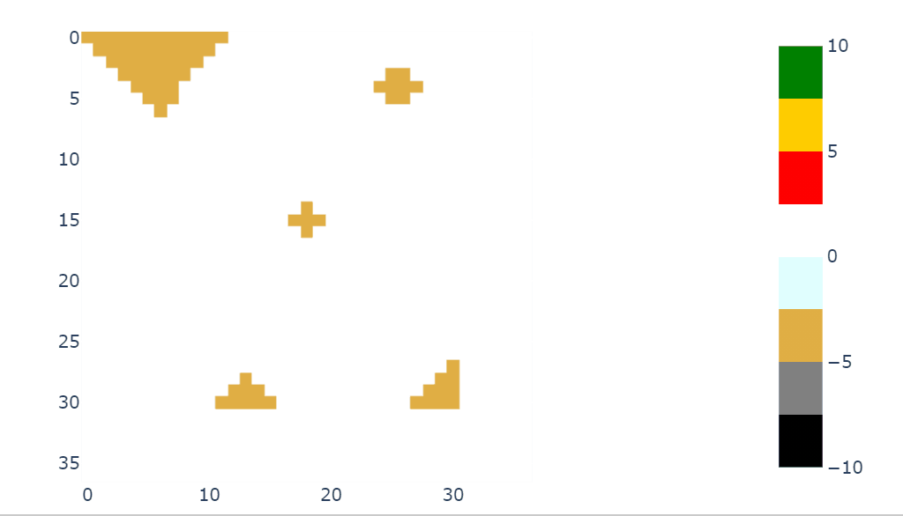
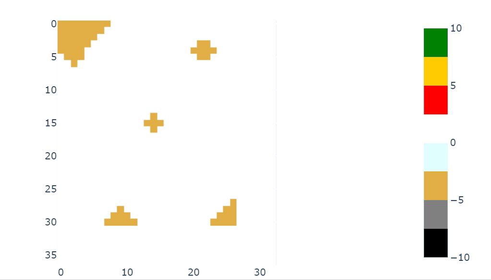
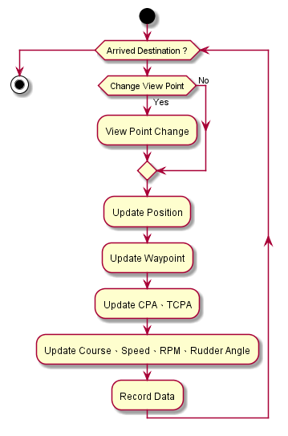
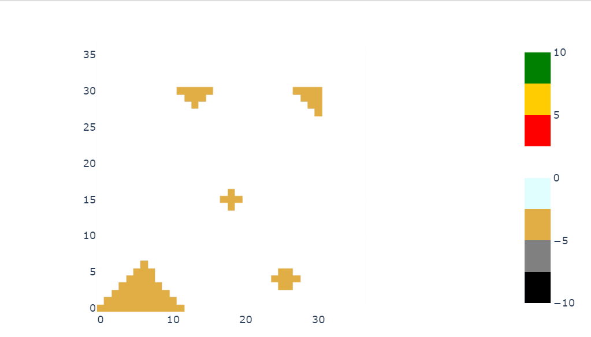

# Chart

This is a template to make animation by ipywidgets and plotly.

- First part is used to visualize the map.
- Second part is used to make the chart move.
- Second part-1 can move center point of chart.

- Second part-2 make a point, and let the point move on the chart. 

---
## Requirements

- ipywidgets==7.6.2
- plotly
- pandas
- numpy

---
## Application

- Ship Movement Simulation

